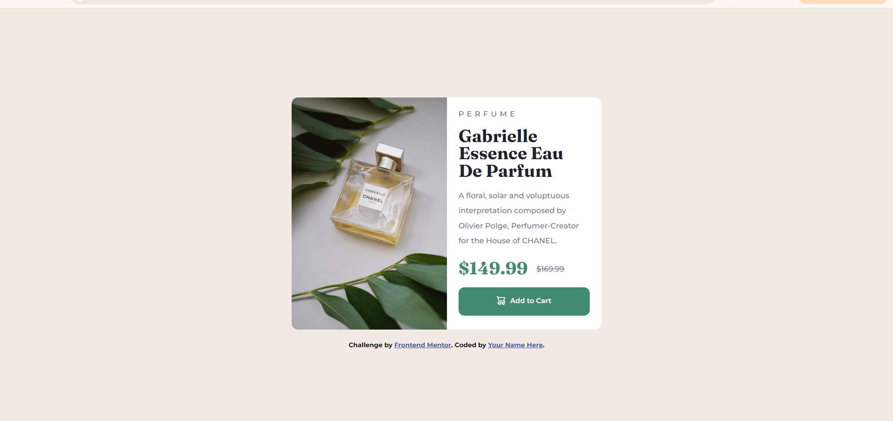

# Frontend Mentor - Product preview card component solution

This is a solution to the [Product preview card component challenge on Frontend Mentor](https://www.frontendmentor.io/challenges/product-preview-card-component-GO7UmttRfa). Frontend Mentor challenges help you improve your coding skills by building realistic projects.

## Table of contents

- [Overview](#overview)
  - [The challenge](#the-challenge)
  - [Screenshot](#screenshot)
  - [Links](#links)
- [My process](#my-process)
  - [Built with](#built-with)
  - [Continued development](#continued-development)
  - [Useful resources](#useful-resources)
- [Author](#author)
- [Acknowledgments](#acknowledgments)

## Overview

### The challenge

Users should be able to:

- View the optimal layout depending on their device's screen size
- See hover and focus states for interactive elements

### Screenshot

### Links

- Solution URL: [https://github.com/Notobd/product-preview-card.git](https://your-solution-url.com)
- Live Site URL: [https://order-summary-component-pilq.vercel.app/](https://your-live-site-url.com)

## My process

I started by building with HTML and then moved on to CSS and made it responsive using media queries.

### Built with

- Semantic HTML5 markup
- CSS custom properties
- Flexbox

### Continued development

I majorly want to focus on getting better with flex box and hopefully start using grid as well.

## Author

- Frontend Mentor - [@notobd](https://www.frontendmentor.io/profile/notobd)
- Twitter - [@n0tobd](https://www.twitter.com/n0tobd)

## Acknowledgments

S/O to Favour always, my biggest source of inspiration.
